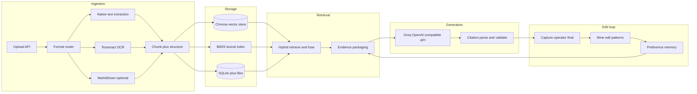

# Gravitas platform: assessment scope and build plan

## Source of truth: assessment brief

The take-home ([`AI Engineer - Assessment.pdf`](/Users/hunter/Desktop/Projects/gravitas/AI%20Engineer%20-%20Assessment.pdf)) defines four core capabilities and explicit deliverables.

**Core capabilities (must ship end-to-end):**

1. **Document processing** — Ingest noisy legal-style inputs (scanned PDFs, low resolution, handwriting-adjacent noise, inconsistent formats). Deliver **extracted text plus structured fields** that need no manual cleanup before retrieval/drafting.
2. **Grounded retrieval** — For a drafting task, **surface relevant passages**, pass them into generation, and make it **possible to inspect which evidence supported which part of the output**. Control unsupported generation.
3. **Draft generation** — Pick one first-pass output type; it must be **relevant, well structured, and grounded** in retrieved evidence (legal correctness is out of scope).
4. **Improvement from operator edits** — **Capture edits**, **extract reusable signal**, and **use it to measurably improve future drafts** — a real loop, not only a side-by-side diff.

**Required submission artifacts (plan the repo layout around these):**

- Source code
- **README** — setup and run
- **Short architecture overview** (dedicated doc is fine, e.g. [`docs/ARCHITECTURE.md`](docs/ARCHITECTURE.md))
- **Assumptions and tradeoffs** (section in README or [`docs/ASSUMPTIONS.md`](docs/ASSUMPTIONS.md))
- **Sample inputs and outputs** (e.g. [`samples/`](samples/) with before/after and citation traces)
- **Evaluation approach and results** (e.g. [`docs/EVALUATION.md`](docs/EVALUATION.md) with rubric-aligned checks)

**Optional but aligned with your goals:** API + simple UI + tests — treat these as **in scope** for “complete platform” while keeping UX “simple and intuitive” per your note (the rubric explicitly deprioritizes visual polish vs engineering). **Docker is out of scope for now** (no Dockerfile or compose in this phase; local README setup only).

**Logistics (from brief):** deadline **Friday May 15, 2026** EOD local; push to GitHub; invite reviewers; email submission — document in README.

---

## Folder layout and naming

| Area | Path | Notes |
|------|------|--------|
| Frontend | [`frontend/`](frontend/) | Use **`frontend`** (your repo already has this folder). “fronted” reads as a typo; keep one canonical name to avoid broken imports and docs. |
| Backend | [`backend/`](backend/) | FastAPI app, workers, persistence, retrieval, LLM clients. |
| Root | `README.md`, `plan.md` | `plan.md` mirrors this plan after approval for versioned execution guidance. |

---

## Recommended draft output type (pick one, justify in docs)

**Default recommendation: “Case fact summary” (timeline + issues + key entities)** with explicit **citation tags** tied to retrieval chunk IDs.

- Maps cleanly to **numbered evidence blocks** in the prompt and **per-section citations** in the UI.
- Easier to evaluate grounding than a free-form memo.
- Alternative acceptable pick: **document checklist** or **internal memo** — same architecture; only prompts and UI labels change.

---

## High-level architecture

**Groq:** Use OpenAI-compatible client with `base_url=https://api.groq.com/openai/v1` and `GROQ_API_KEY` ([Groq overview](https://console.groq.com/docs/overview)). Model id via env (e.g. `GROQ_MODEL`) so you can swap without code changes.

---

## Backend design ([`backend/`](backend/))

**Framework and API**

- **FastAPI** — REST for upload, document status, chunk preview, “generate draft”, “save operator version”, and “list citation trace”.
- **Pydantic v2** for request/response models.
- **Local file storage** under `backend/data/` (or configurable `DATA_DIR`).
- **SQLite** — Stores **relational / structured data**: document records, full chunk text and provenance (page, bbox, `ocr_confidence`, `source`), draft versions, operator corrections, and any app state you need to join or query with SQL. No separate database server; good for a self-contained take-home demo.
- **Chroma** — The **vector database** for this project: persistent **embedding index** and **similarity search** over chunk vectors. Each point stores the embedding plus **metadata** (`chunk_id`, `doc_id`, optional page) so results map back to SQLite rows for display and citations. **Why Chroma:** mature Python client, on-disk persistence without running a separate vector server, fits a textbook RAG layout (ingest → embed → collection.upsert → collection.query). Reasonable alternatives would be **LanceDB** or **Qdrant** in local mode; the plan standardizes on **Chroma** to avoid splitting attention across too many storage backends.

**Document processing pipeline**

1. **Detect input type** — PDF, image (png/jpg/tiff), DOCX, etc.
2. **PDFs with text layer** — Prefer **pypdf** / **pdfplumber** for text + page numbers; cheap and deterministic.
3. **Scanned or low text density** — Rasterize pages (e.g. **pymupdf** / `pdf2image` if Poppler available) + **Tesseract** via **pytesseract** with light **Pillow** preprocessing (grayscale, contrast, optional deskew if you add a small utility).
4. **Office / mixed** — Use **[MarkItDown](https://github.com/microsoft/markitdown)** when it clearly helps (DOCX, PPTX, HTML, etc.). For PDFs: use MarkItDown **only when native extraction is empty or unusable** so you avoid redundant work and keep dependencies justified (per your “if needed” rule).
5. **Structured output** — For each chunk, persist: `doc_id`, `chunk_id`, `text`, `page`, optional `bbox`, `source` (`native` | `ocr` | `markitdown`), **`ocr_confidence`** when from Tesseract, and optional **heuristic fields** (detected headings via line length/caps patterns, dates via regex, entity placeholders). This satisfies “structured data downstream can use.”

**Standard RAG pipeline (end-to-end, explicit stages)**

The earlier plan described pieces of retrieval; below is the **canonical pipeline** this build follows (query-time path is what reviewers mean by “RAG”):

1. **Load** — Accept uploaded files; normalize to extractable representation (bytes, PDF pages, images).
2. **Parse / extract text** — Native PDF text, OCR path, or MarkItDown per the document router; attach page and quality signals.
3. **Chunk** — Split into overlapping segments with stable `chunk_id`, token/char limits, and metadata (document id, page span, extraction source).
4. **Persist source chunks** — Write full text + metadata to **SQLite** (source of truth for UI and audits).
5. **Embed** — Encode each chunk with a **local** embedding model (**sentence-transformers**, e.g. `all-MiniLM-L6-v2`) so Groq is not required for indexing and costs stay predictable.
6. **Vector upsert** — Upsert embeddings into **Chroma** (same `chunk_id` in metadata) after each ingest or re-index job.
7. **Lexical index** — Build or refresh a **BM25** index (**rank_bm25**) over the same chunks for keyword / phrase-heavy legal queries.
8. **Query encoding** — On user request, embed the **task query** (and optionally short conversation context) with the same embedding model.
9. **Retrieve (hybrid)** — Run **dense top‑k** from Chroma and **lexical top‑k** from BM25 in parallel.
10. **Fusion** — Merge ranked lists (**reciprocal rank fusion** is a simple, standard choice; fixed-weight blending is acceptable) and **deduplicate** by `chunk_id`.
11. **Context build** — Apply a **token budget**; truncate lowest-ranked hits; assign evidence labels **`E1…En`** and serialize passages for the prompt (no text outside this list should be treated as evidence).
12. **Generate** — Call **Groq** with system rules enforcing **citations to `E#` only** and the chosen draft schema.
13. **Grounding check** — Parse output citations; flag or strip uncited or invalid `E#` references; optional **single repair** Groq call if validation fails (log in evaluation).

**Maturity note:** Stages 1–13 are a **complete, standard** retrieval-augmented generation stack for this use case (ingest → dual index → hybrid retrieve → fuse → constrained prompt → validate). **Deliberately not in initial scope:** a cross-encoder **reranker** (extra latency and dependency) or online learning of the retriever; the **operator-edit loop** remains the separate “memory” channel into step 11 (injected block), not a replacement for core RAG.

**Retrieval and grounding (summary)**

- **Chunking** — Same as stage 3 above.
- **Hybrid retrieval** — Stages 8–10: Chroma (dense) + BM25 (lexical) + fusion.
- **Prompting** — Stage 11–12: only `E1…En` in context; explicit citation rules.
- **Post-validation** — Stage 13.

**Draft generation (Groq)**

- System + user messages: task description, output schema (sections), evidence list, and strict rules: “Every substantive bullet must cite at least one `E#`.”
- Return JSON or markdown with stable citation tokens for the UI to link.

**Improvement from operator edits (rubric-critical)**

Implement a **preference memory** loop, not just diff display:

1. **Versioning** — Store **model draft** and **operator final** (rich text or markdown) with timestamps.
2. **Diff mining** — Sentence- or paragraph-level diff (**difflib** or **diff-match-patch**); align segments to the **nearest retrieved chunk** (by embedding similarity or overlap) to attach **evidence anchors** to each changed span.
3. **Persist reusable artifacts** — Table e.g. `operator_corrections`: `context_embedding`, `before_snippet`, `after_snippet`, `evidence_chunk_ids`, `task_type`.
4. **Use in future runs** — Before calling Groq, **retrieve top-k past corrections** whose context embedding is similar to the current query + top retrieved chunks; inject a short **“Organization style / prior operator corrections”** block into the prompt (few-shot style). This yields a **measurable** improvement story: compare draft with/without memory on fixed sample docs (document in [`docs/EVALUATION.md`](docs/EVALUATION.md)).

**Supporting libraries (optimal extras)**

- **HTTP:** `httpx` (async client if you async Groq calls).
- **Config:** `pydantic-settings`.
- **Schema setup (no Alembic initially):** Use SQLAlchemy’s **`create_all`** so the app **creates tables from your models on startup** when they are missing. That is enough for a single-developer take-home. **Alembic** is a **migration** tool: it keeps **versioned, repeatable scripts** that change the schema over time (add column, new table) across dev/stage/prod. Add Alembic only if you expect ongoing schema evolution beyond ad-hoc resets.
- **Tests:** `pytest` for ingestion, citation parser, and retrieval; optional golden files under `backend/tests/fixtures/`.

---

## Frontend design ([`frontend/`](frontend/))

**Stack:** **React + Vite + TypeScript + Tailwind CSS** (lightweight, matches your requirement).

**Screens (minimal but complete)**

1. **Upload** — Drag/drop; show processing status and warnings (low OCR confidence).
2. **Document workspace** — Chunk list / preview, OCR vs native badges, page references.
3. **Drafting** — Task selector (fixed to your chosen draft type), “Generate draft”, side panel **evidence list** (`E#` → passage), main panel draft with **clickable citations** highlighting source chunks.
4. **Operator review** — Editable draft; **Save final** posts to backend to close the learning loop.
5. **Runs / evaluation (light)** — Simple page or README-driven scripts calling the API for repeatable eval.

**API client:** `fetch` or a thin **TanStack Query** layer if you want caching; avoid heavy state libraries unless needed.

---

## Repository deliverables checklist (maps to rubric)

| Rubric area | What reviewers will see |
|-------------|-------------------------|
| Document processing (25) | Noisy + scanned samples in `samples/`; logs or UI for OCR confidence; structured chunk JSON in API |
| Retrieval & grounding (25) | Chroma + BM25 hybrid; evidence panel; citation validation; unsupported-claim control |
| Draft quality (10) | Clear sectioning; grounded bullets; README sample I/O |
| Edits → improvement (25) | Saved versions; correction memory; eval showing improvement with memory on |
| Code & design (10) | Clear `frontend/` vs `backend/` modules; errors surfaced |
| Documentation (5) | README, architecture, assumptions, evaluation |

---

## Implementation order (practical sequencing)

1. **Backend skeleton** — FastAPI, settings, SQLite models, Chroma client + collection path, file upload.
2. **Ingestion** — Router + native PDF + Tesseract path + optional MarkItDown; persist chunks to SQLite.
3. **Indexing / RAG core** — Embed chunks → Chroma upsert; build BM25; hybrid retrieve + fuse; API returns packaged `E#` blocks.
4. **Groq draft** — Prompt + citation format + parser + persistence.
5. **Frontend** — Upload → document → draft UI with citations.
6. **Edit loop** — Save operator text; mine corrections; inject memory into prompt.
7. **Polish submission** — Samples, architecture doc, evaluation write-up (no Docker in this phase).

---

## Risks and mitigations

- **Handwriting** — Tesseract is weak on freeform handwriting; document assumption: cursive may be partial; show confidence and allow operator paste/correction (honest tradeoff in `ASSUMPTIONS`).
- **Poppler / Tesseract install** — Document macOS (`brew install tesseract poppler`) and Linux packages in README for local development.
- **Groq rate limits** — Batch eval carefully; cache embeddings locally.

---

## Post-approval: `plan.md` in repo root

After you exit plan-only mode and approve implementation, the first implementation step should be to **write this content to [`plan.md`](plan.md)** at the project root so the repo matches your requested filename and stays versioned with the code.
