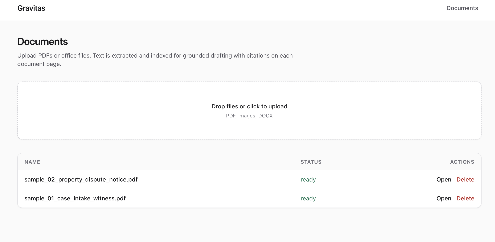
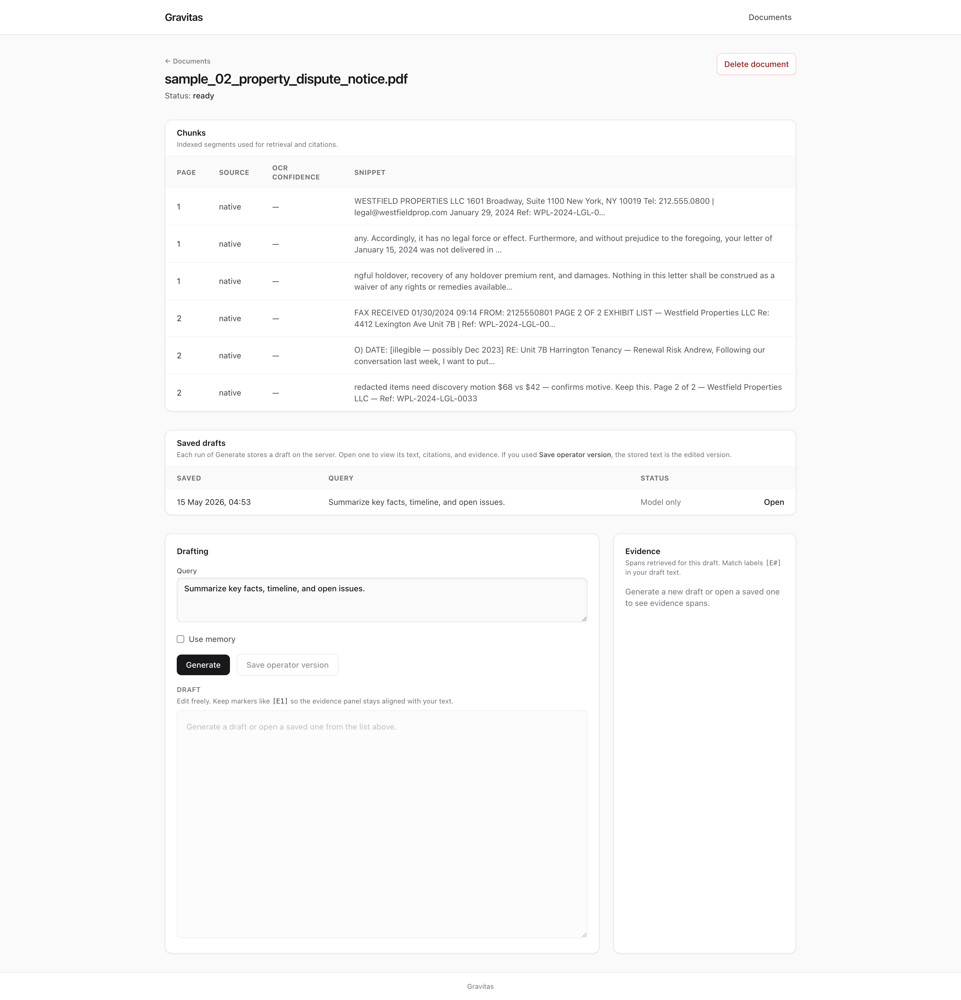
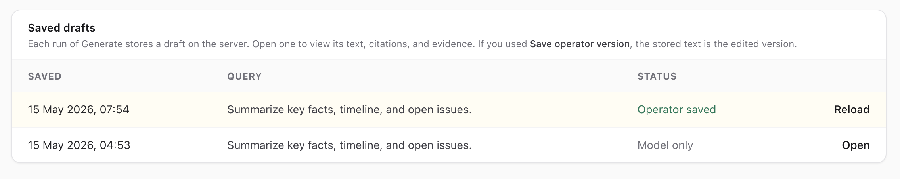
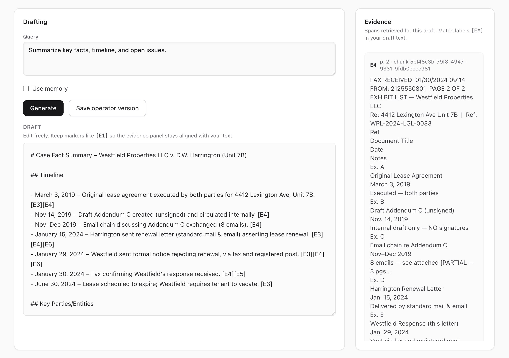

# Gravitas

[](https://www.python.org/)
[](https://fastapi.tiangolo.com/)
[](https://docs.conda.io/)
[](https://www.sqlite.org/)
[](https://www.trychroma.com/)  
[](https://react.dev/)
[](https://vitejs.dev/)
[](https://www.typescriptlang.org/)
[](https://tailwindcss.com/)  
[](https://groq.com/)
[](https://pytorch.org/)
[](https://www.sbert.net/)
[](https://github.com/tesseract-ocr/tesseract)

Internal workflow for **messy legal-style documents**: extract text (with OCR when needed), **hybrid RAG** (Chroma + BM25), **Groq**-powered grounded drafting with inspectable evidence tags, and an **operator edit** memory loop.

See [plan.md](plan.md) for the assessment-aligned architecture and [DIRECTORY_STRUCTURE.md](DIRECTORY_STRUCTURE.md) for a folder map.

## Quick start

Prerequisites: [Conda](https://docs.conda.io/) (or Miniconda/Miniforge), [Node.js](https://nodejs.org/) 18+, and a [Groq API key](https://console.groq.com/). Run the **backend** and **frontend** in separate terminals.

### Python environment (Conda)

Use a Conda env named **`gravitas`** with **Python 3.11** (declared in [environment.yml](environment.yml)).

**macOS / Linux** (bash or zsh, from repo root):

```bash
# Creates env gravitas and pip-installs backend/requirements.txt
conda env create -f environment.yml
# If the env already exists and you changed dependencies:
# conda env update -f environment.yml --prune

conda activate gravitas
cd backend
cp .env.example .env
# Set GROQ_API_KEY in .env. Tune non-secret knobs in config.yaml.

pip install -r requirements.txt   # safe to re-run; matches environment.yml pip section

uvicorn app.main:app --reload --host 127.0.0.1 --port 8000
```

**Windows** (Anaconda Prompt, PowerShell, or cmd, from repo root):

```bat
conda env create -f environment.yml
REM If the env already exists: conda env update -f environment.yml --prune

conda activate gravitas
cd backend
copy .env.example .env
REM Set GROQ_API_KEY in .env (Notepad or your editor). Tune non-secret knobs in config.yaml.

pip install -r requirements.txt

uvicorn app.main:app --reload --host 127.0.0.1 --port 8000
```

PowerShell equivalent for copying `.env`:

```powershell
Copy-Item .env.example .env
```

**Tests** (same env, from `backend/`):

```bash
pytest
```

(`pytest` works the same in Anaconda Prompt / PowerShell on Windows.)

#### System dependencies (OCR / PDF rasterization)

| Platform | Install |
|----------|---------|
| **macOS** | `brew install tesseract poppler` |
| **Linux (Debian/Ubuntu)** | `sudo apt-get install -y tesseract-ocr poppler-utils` |
| **Windows** | Install **Tesseract** and **Poppler** and ensure both are on your `PATH`. Examples (run an elevated terminal if your package manager requires it): **Chocolatey:** `choco install tesseract poppler -y` · **Scoop:** `scoop install tesseract poppler` · **winget:** `winget install UB-Mannheim.TesseractOCR` (then install a Poppler Windows build, e.g. from [poppler-windows releases](https://github.com/oschwartz10612/poppler-windows/releases), and add its `bin` folder to `PATH`). Restart the terminal after installing. |

### Frontend

**macOS / Linux / Windows** (from repo root):

```bash
cd frontend
npm install
npm run dev
```

On Windows, use the same commands in PowerShell or cmd (`cd frontend` then `npm install` / `npm run dev`).

Vite proxies `/api` and `/health` to `http://127.0.0.1:8000` during development. Optional: set `VITE_API_URL` in `frontend/.env` (see `frontend/.env.example`). Open **http://localhost:5173** once both servers are running.

### Web app (what you get in the UI)

Open **http://localhost:5173** after starting the backend and frontend.

- **Documents** — Upload files, see processing status, **open** a document, or **delete** it. Delete uses an in-app confirmation modal (not the browser `confirm` dialog).



- **Document workspace** — After **ready**: chunk table, **saved drafts** list (every **Generate** creates a server-side draft; **Open** reloads text + evidence), drafting query with optional **Use memory**, editable draft textarea, evidence column, **Save operator version**.







- **Delete document** — Available from the list and from the document header; removes SQLite rows (cascading chunks and drafts), Chroma vectors for that id, and files under `backend/data/files/<id>/`.

## Configuration

| Location | Purpose |
|----------|---------|
| `backend/.env` | **Secrets** (e.g. `GROQ_API_KEY`). Optional `GROQ_MODEL`, `DATA_DIR`. |
| `backend/config.yaml` | Tunables: Groq model default, embedding model, chunk sizes, retrieval `k`, CORS origins, prompt file path. |
| `backend/prompts/drafting.yaml` | LLM prompt templates (Jinja2). |
| `environment.yml` | Conda env **`gravitas`** (Python 3.11) + pip requirements. |
| `DIRECTORY_STRUCTURE.md` | One-line purpose map for repo folders. |

## API (high level)

- `POST /api/documents` — multipart upload; processing runs in background.
- `GET /api/documents`, `GET /api/documents/{id}`, `GET /api/documents/{id}/chunks`
- `DELETE /api/documents/{id}` — remove document, chunks, drafts, on-disk upload folder, and Chroma vectors for that id (`204` on success).
- `POST /api/documents/{id}/draft` — JSON `{ "query": "...", "use_memory": true }`; persists a **Draft** row and returns `draft_id`, content, evidence, `citation_issues`.
- `GET /api/documents/{id}/drafts` — list saved drafts for a document (metadata: query, `created_at`, `has_operator_version`).
- `GET /api/drafts/{draft_id}` — load a saved draft (content prefers operator text when present; evidence replayed from storage).
- `POST /api/drafts/{draft_id}/operator` — JSON `{ "text": "..." }` saves operator text and mines edit pairs for future prompts.

## Submission docs

- [docs/ARCHITECTURE.md](docs/ARCHITECTURE.md)
- [docs/ASSUMPTIONS.md](docs/ASSUMPTIONS.md)
- [docs/EVALUATION.md](docs/EVALUATION.md)
