# Architecture

This document describes how **Gravitas** is put together: major components, how data moves through the system, and how **retrieval-augmented generation (RAG)** is implemented end-to-end. For a quick folder map, see [DIRECTORY_STRUCTURE.md](../DIRECTORY_STRUCTURE.md).

## Goals

The service ingests **noisy legal-style** files (PDFs, scans, office formats), turns them into **searchable chunks** with provenance, retrieves **only relevant passages** for a drafting task, and asks **Groq** to produce a **grounded** first-pass summary whose claims can be traced to numbered evidence. A separate **operator edit** path captures corrections and feeds a lightweight **memory** block into later prompts so drafts can improve without fine-tuning the base model.

## High-level system architecture

**Groq:** OpenAI-compatible client with `base_url=https://api.groq.com/openai/v1` and `GROQ_API_KEY` ([Groq overview](https://console.groq.com/docs/overview)); the browser never sees API keys. Model id defaults in `config.yaml` and can be overridden with `GROQ_MODEL` in `.env`.

**Reading the diagram:** uploads are normalized and chunked once; **SQLite** holds canonical text and metadata; **Chroma** holds dense vectors for semantic search; **BM25** answers keyword-heavy queries. At draft time, **Hybrid** combines both signals, **Pack** turns the fused set into labeled evidence for the LLM, and **Parse** enforces grounding. **Mine** / **Mem** implement the operator-improvement loop by injecting a short “preferences” block into **Pack** on subsequent runs.

## Major components

| Layer | Role | Primary code |
|--------|------|----------------|
| **API** | HTTP routes, multipart upload, draft and operator-save endpoints. | [`backend/app/main.py`](../backend/app/main.py), [`backend/app/api/routers/`](../backend/app/api/routers/) |
| **Core config** | `.env` secrets, `config.yaml` tunables, Jinja-rendered prompts from YAML files. | [`backend/app/core/`](../backend/app/core/), [`backend/config.yaml`](../backend/config.yaml), [`backend/prompts/drafting.yaml`](../backend/prompts/drafting.yaml) |
| **Persistence** | SQLAlchemy models and SQLite session; files under `backend/data/`. | [`backend/app/db/`](../backend/app/db/) |
| **Ingestion** | Format routing, PDF native vs OCR, optional MarkItDown, chunking with overlap. | [`backend/app/ingestion/`](../backend/app/ingestion/) |
| **RAG** | Embeddings, Chroma client, BM25 over in-memory tokenized corpus, RRF fusion, evidence packing. | [`backend/app/rag/`](../backend/app/rag/) |
| **LLM** | Groq via OpenAI-compatible client, JSON draft shape, citation validation and optional repair. | [`backend/app/llm/`](../backend/app/llm/) |
| **Learning** | Diff-based correction snippets, embeddings for memory retrieval, prompt injection. | [`backend/app/learning/edits.py`](../backend/app/learning/edits.py) |
| **Frontend** | React + Vite + TypeScript + Tailwind; upload, chunk view, evidence panel, editable draft. | [`frontend/src/`](../frontend/src/) |

## End-to-end data flow (narrative)

1. A document is **uploaded** and stored on disk; a row is created in SQLite with `pending` status.
2. A **background task** runs ingestion: extract text (native PDF, **Tesseract** on low-text pages, or **MarkItDown** for office types), **chunk** with configurable size and overlap, then write **Chunk** rows.
3. Each chunk is **embedded** locally (**sentence-transformers** / PyTorch) and **upserted** into **Chroma** with metadata linking back to SQLite `chunk_id` and `document_id`.
4. When the user requests a **draft**, the backend **embeds the query**, runs **dense retrieval** (Chroma) and **lexical retrieval** (BM25 rebuilt from chunks for that document), **fuses** rankings with **reciprocal rank fusion** (`backend/app/rag/fusion.py`), trims to a token budget, and labels passages **E1…En**.
5. Optionally, **operator memory** (short text from past corrections similar to the current query) is prepended to the user prompt.
6. **Groq** returns JSON matching the case-fact schema; the service **validates citations** against the evidence set and may run a **single repair** completion if tags are invalid.
7. The draft and evidence list are **persisted**; operator saves run **diff mining** and store correction rows for future **memory** retrieval.

## RAG pipeline

**RAG** here means: *retrieve evidence that is actually in the corpus, show it to the model under strict labels, and verify the model only cites those labels.* Indexing and query paths are separated below.

### Stages (indexing and query)

| Phase | Step | What happens |
|--------|------|----------------|
| **Indexing** | Parse and chunk | Router picks native PDF text, OCR, or MarkItDown; output is overlapping chunks with page and `source` metadata. |
| **Indexing** | Persist | Full chunk text written to **SQLite** (source of truth for UI and audits). |
| **Indexing** | Embed | Local embedding model encodes each chunk vector (no Groq spend on indexing). |
| **Indexing** | Vector store | Vectors upserted to **Chroma** with `chunk_id` / `document_id` metadata. |
| **Indexing** | Lexical | Same chunk texts tokenized for **BM25** at query time (rebuilt per request for demo scale). |
| **Query** | Query encoding | User `query` string embedded with the **same** model as chunks. |
| **Query** | Hybrid retrieve | **Top‑k** dense neighbors from Chroma and **top‑k** BM25 hits in parallel, scoped to the active document. |
| **Query** | Fusion | **RRF** merges two ranked lists and deduplicates by `chunk_id`. |
| **Query** | Context build | Truncate to `max_context_chunks` / char budget; assign **E1…En**; serialize only those passages into the prompt. |
| **Query** | Memory (optional) | Top similar **operator_corrections** snippets appended as a “preferences” block (does not replace evidence). |
| **Query** | Generate | Groq receives system + user messages; JSON output with bullets citing `[E#]`. |
| **Query** | Grounding check | Parser validates `[E#]` labels; optional **repair** pass; issues surfaced to the client as `citation_issues`. |

**Out of scope for v1:** cross-encoder reranking, continual learning of the retriever weights, and multi-tenant isolation (single SQLite + local Chroma path per deployment config).

### RAG pipeline diagram

The plan defines the RAG stages as a **numbered list** (stages 1–13); the figure below uses the **same diagram language as the plan’s high-level architecture** (`flowchart LR`, `subgraph` groupings, `Label[text]` nodes, solid `-->` edges). It maps those stages onto indexing, hybrid retrieval, evidence packaging, optional memory, and generation/validation.

**Preview:** rendered as SVG (see [diagrams/rag-pipeline.mmd](diagrams/rag-pipeline.mmd)).

Stages **8–11** correspond to query encoding, parallel dense and lexical retrieval, RRF fusion and deduplication, context packing with evidence labels, and the optional **operator memory** block merged into the prompt before **Groq** (stage **12**). Stage **13** is citation validation and an optional **repair** completion if tags are invalid.

## Design choices (short)

- **SQLite + Chroma**: relational data and vectors are split so SQL stays simple and similarity search stays in a purpose-built store.
- **Local embeddings**: keeps indexing cost and latency predictable; Groq is reserved for the generative step.
- **Hybrid + RRF**: legal-style queries often mix exact phrases (parties, statute refs) with paraphrases; BM25 + dense covers both.
- **External prompts**: `drafting.yaml` keeps iteration on wording and schema out of Python diffs.

For evaluation ideas tied to this architecture, see [EVALUATION.md](EVALUATION.md).
